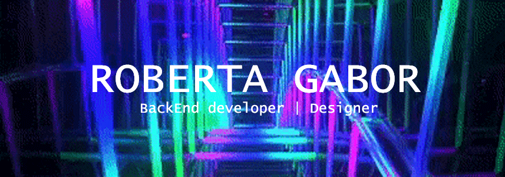

## Hello there! 👋✨

<h2 align="center">I am Roby! my game tag Pokxcita is also welcomed. Here you will find mt proyects (currently for my college) and of my own. Its still in progress and organization.</h2>
<h2 align="center"> Im a Junior Programmer, I've worked on Arduino Software and Javascript; Im currently focus on C# and POO(programming objects oriented), I have knowledge on .NET and VS IDE. The presentations of my proyects are all on spanish as like almost all of my commits. Here you can find: C, C#, Javascript, Python <h2>

<h2 align="center">See you soon General Kenobi!<h2>

<!--
**RobertaGabor/RobertaGabor** is a ✨ _special_ ✨ repository because its `README.md` (this file) appears on your GitHub profile.

Here are some ideas to get you started:

- 🔭 I’m currently working on ...
- 🌱 I’m currently learning ...
- 👯 I’m looking to collaborate on ...
- 🤔 I’m looking for help with ...
- 💬 Ask me about ...
- 📫 How to reach me: ...
- 😄 Pronouns: ...
- ⚡ Fun fact: ...
-->

